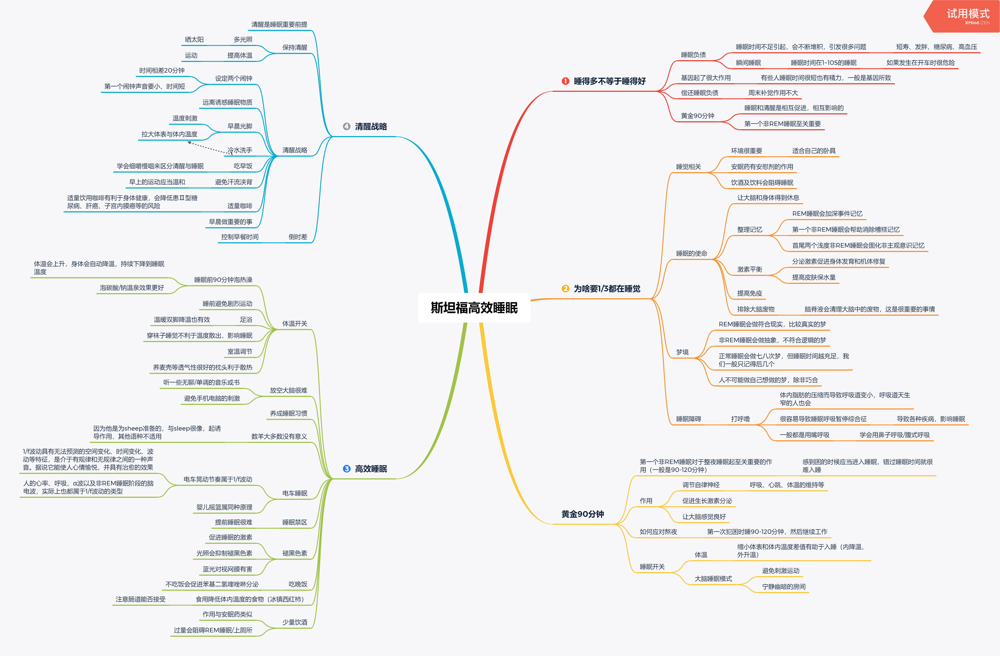
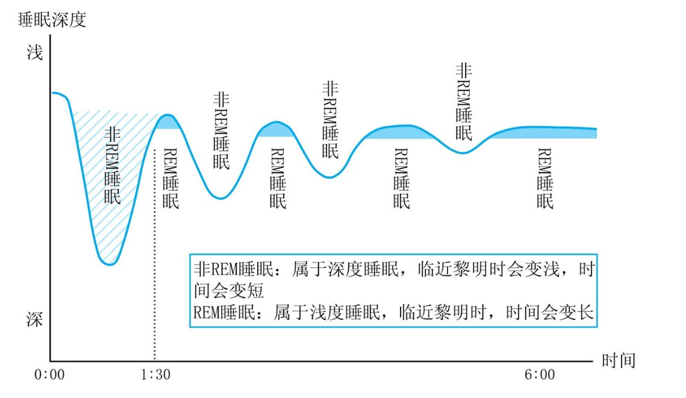

# 睡眠十律

*本文主要是《斯坦福高效睡眠》的读书笔记，请以思维导图为主要大纲阅读，文字仅供拓展。本文名称取自BBC同名纪录片，因为我在读完本书后发现作者的很多观点和建议与该纪录片内容类似。本文最后会记录睡眠十律内容。**本文内容有很高的执行性，如果你也是被失眠困扰或想要拥有更好的精力，可以坚持养成习惯***

## 《斯坦福高效睡眠》

> 人生的1/3时间是在黑夜中度过的，但是它却直接决定着余下的2/3。

### 快速说明

睡觉的好处：精神好，成绩好

长高、新陈代谢、抗衰老

### 睡得多不如睡得好

作者认为，长时间的睡眠负债会不断积累，直到身体崩盘；其中最容易导致`瞬间睡眠`。瞬间睡眠就是睡眠时间在1~10S的睡眠，这种状态很难被发现，而且很危险（比如开车或高空作业时）。除此之外，还会导致短寿、发胖、糖尿病、高血压。

睡眠的时间长短很大部分取决于基因。短时间睡眠就能拥有很好状态的人不必强迫自己多睡，长时间睡眠才能拥有很好状态的人也尽量不要压缩自己的睡眠时间。长时间睡眠也会导致一些不好的影响，比如：午休超过1个小时会增加患痴呆症和糖尿病的风险。

睡眠负债需要长时间的增加睡眠来弥补，周末补觉来偿还不太现实。

睡眠和清醒是相互促进、相互影响的。良好的睡眠会增加饮食和运动的效果，良好的饮食和运动又会促进睡眠。因此，良好的睡眠质量至关重要。

此图的一些信息：

- REM睡眠（rapid eyes movement，快速眼球运动）：大脑已经清醒，身体仍然熟睡。
- 非REM睡眠：大脑和身体都陷入睡眠
- 第一次REM睡眠会进行快速眼球运动，会做较为实际的梦
- REM和非REM睡眠会交替4-5次，最后的REM时间变长

**刚开始的90分钟非REM睡眠至关重要**

刚开始的非REM睡眠会分泌生长激素促进细胞生长、新陈代谢和抗衰老。

本书的一些其他信息：

1. 咖啡会因会阻碍腺苷发挥作用，所以可以驱走睡意
2. 苯基二氢喹唑啉（orexin）：强效唤醒作用的神经传导物质，还关系到对食物的摄取（进食）
3. 白天不适合睡眠：白天身体停止分泌皮质醇

## 睡眠十律

1. 睡前至少一个小时左右泡个热水澡，体温会不断下降
2. 睡眠限制，减少卧室逗留时间，卧室只用来睡觉，同一时间起床(无论你困不困)
3. 打盹疗法：如果没有足够的时间睡眠，尝试在下午2－5点打盹，每次半小时，其他时间保持清醒
4. 打呼噜，可以尝试处方药或口腔器具
5. 咖啡或酒精都会影响睡眠
6. 摄取碳水化合物会增加睡意（增加胰岛素->色氨酸进入大脑->转换为5-羟色胺，产生睡意），蛋白质会抑制睡意（蛋白质转换为氨基酸，氨基酸阻止色氨酸进入大脑）
7. 在黑暗的房间睡觉，早晨晒太阳或照日光灯（影响褪黑色素）
8. 倒时差，人在饥饿16小时之后会唤醒食物钟，新时区的第一餐会重置食物钟
9. 肌肉放松训练，从脚到头肌肉紧绷再放松
10. 药剂辅助，薰衣草/缬草泡茶或足浴有助于睡眠