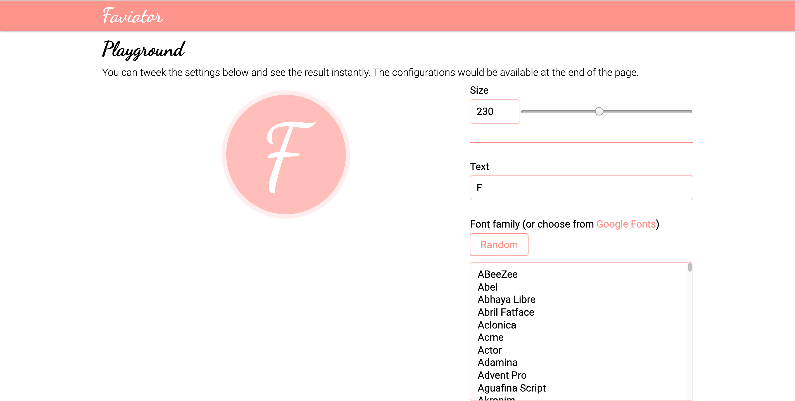
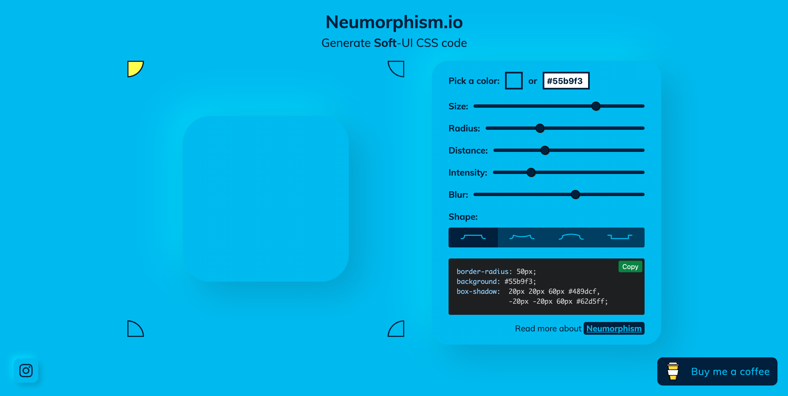
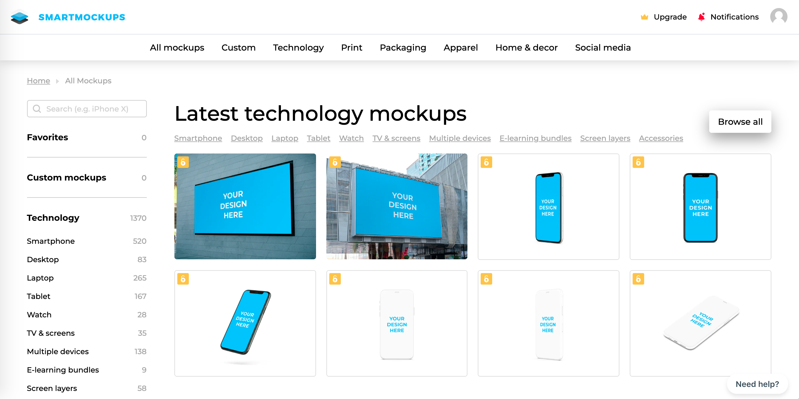
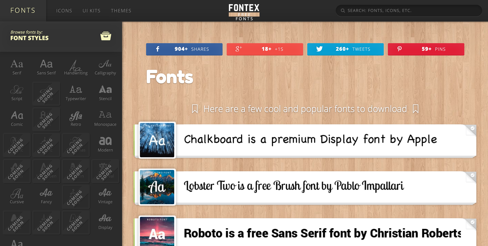
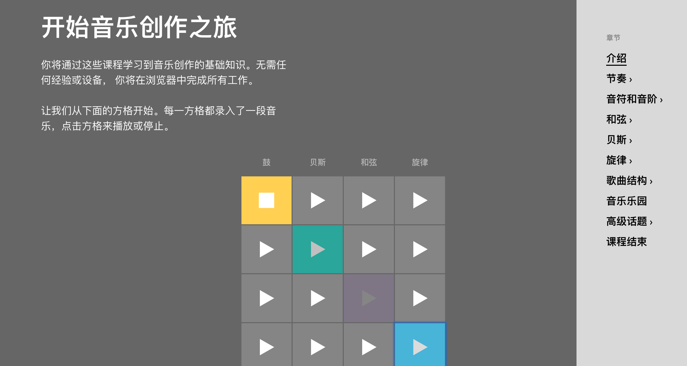

---

prev: ./windows
next: ./mac

---

# 网站推荐

[TOC]

### 选肌肉定运动方式💪

> 根据选择肌肉来查找运动方式
>
> 访问地址：https://musclewiki.org/

### 渐变背景图

> 根据颜色来生成渐变图片或CSS样式
>
> 访问地址：https://uigradients.com/#Winter
>
> 类似网站地址：
>
> https://webkul.github.io/coolhue/
>
> https://webgradients.com/
>
> https://gradient.shapefactory.co/

### 快速生成简单图标

>选择字体，加载样式，生成图标，就是辣么简单
>
>访问地址：https://www.faviator.xyz/

### 新拟态UI生成

> UI设计中，继拟物化、扁平化之后的又一选择。可以应用在PPT、web、APP等设计中。
>
> 访问地址：https://neumorphism.io/#55b9f3

### 样机素材

> 在素材中嵌入你想要的图片
>
> 访问地址：https://smartmockups.com/

### 免费字体下载

> 多种英文字体下载
>
> 访问地址：http://www.fontex.org/free-fonts.html

### 在线制作音乐

> 快速学习音乐知识，通过简单的旋律组合成一段音乐
>
> 访问地址：https://learningmusic.ableton.com/zh/index.html

### 后台管理模板

> 基于Vue的后台模板
>
> 访问地址：https://flatlogic.com/templates/sing-app-vue-dashboard/demo

