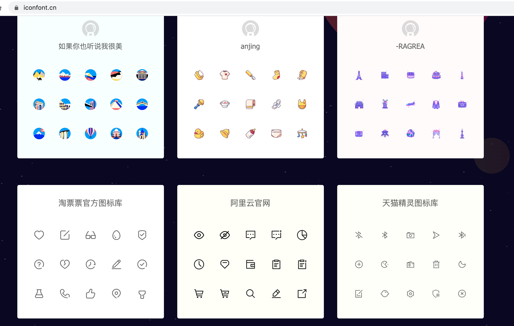
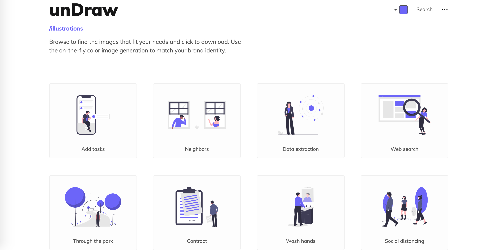
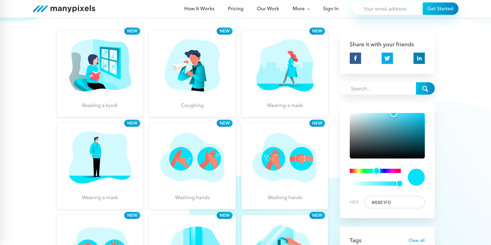
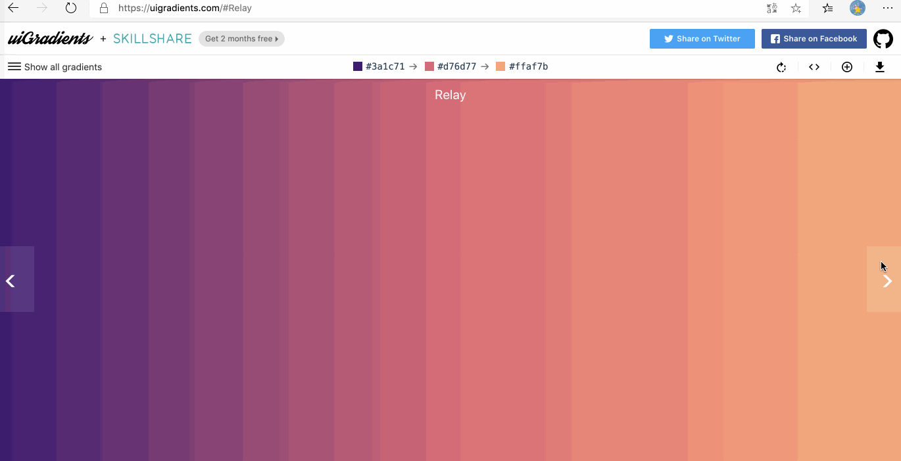
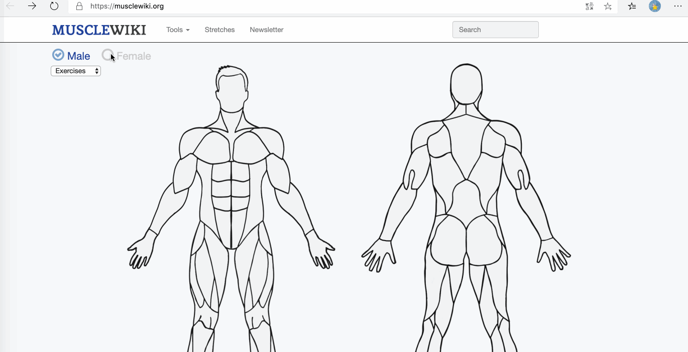

---

prev: ./windows
next: ./mac

---

# 网站推荐

[TOC]

## Icon图标下载

> 阿里巴巴矢量图，汇集了众多设计师设计的图标，可以在线修改图标颜色并免费下载，但商用时应当注意版权问题
>
> 访问地址：[www.iconfont.cn](www.iconfont.cn)

## 矢量图图片

> 可以让PPT、前端页面等设计变得更加美观，当然，它们是支持更换图片颜色的
>
> 访问地址（图片顺序与访问地址顺序一致）：
>
> [https://undraw.co/illustrations](https://undraw.co/illustrations)
>
> [https://www.manypixels.co/gallery/](https://www.manypixels.co/gallery/)
>
> [https://isoflat.com/](https://isoflat.com/)

## 渐变背景图

> 根据颜色来生成渐变图片或CSS样式
>
> 访问地址：[https://uigradients.com/#Winter](https://uigradients.com/#Winter)
>
> 类似网站地址：
>
> [https://webkul.github.io/coolhue/](https://webkul.github.io/coolhue/)
>
> [https://webgradients.com/](https://webgradients.com/)
>
> [https://gradient.shapefactory.co/](https://gradient.shapefactory.co/)

由于GIF录制分辨率不够，会出现白条，请见谅。

## 快速生成简单图标

>选择字体，加载样式，生成图标，就是辣么简单
>
>访问地址：[https://www.faviator.xyz](https://www.faviator.xyz)

## 新拟态UI生成

> UI设计中，继拟物化、扁平化之后的又一选择。可以应用在PPT、web、APP等设计中。
>
> 访问地址：[https://neumorphism.io/#55b9f3](https://neumorphism.io/#55b9f3)

## 样机素材

> 在素材模板中嵌入你想要的图片
>
> 访问地址：[https://smartmockups.com/](https://smartmockups.com/)

## 免费字体下载

> 多种英文字体下载
>
> 访问地址：[http://www.fontex.org/free-fonts.html](http://www.fontex.org/free-fonts.html)

## 在线制作音乐

> 快速学习音乐知识，通过简单的旋律组合成一段音乐
>
> 访问地址：[https://learningmusic.ableton.com/zh/index.html](https://learningmusic.ableton.com/zh/index.html)

## 后台管理模板

> 基于Vue的后台模板
>
> 访问地址：[https://flatlogic.com/templates/sing-app-vue-dashboard/demo](https://flatlogic.com/templates/sing-app-vue-dashboard/demo)

## 选肌肉定运动方式💪

> 根据选择肌肉来查找运动方式
>
> 访问地址：[https://musclewiki.org/](https://musclewiki.org/)

**持续更新ing**