---

next: ./SpringBoot学习笔记二：整合Swagger-UI
---

# SpringBoot学习笔记一：简单项目搭建

[TOC]

这是SpringBoot学习系列的第一个笔记。希望这是一个美好的开端，也希望后续本人能够完成整个SpringBoot框架的学习。这是初学者的学习笔记，操作过程尽量简单详细，大神请轻喷（狗头保命）。话不多说，下面介绍几种创建SpringBoot项目的方法。
<!-- more -->

## 方式一：Spring Initializr

>  这是Spring官方提供的在线搭建SpringBoot项目的工具。

### 1.1.访问网站https://start.spring.io/ 

如下图所示：

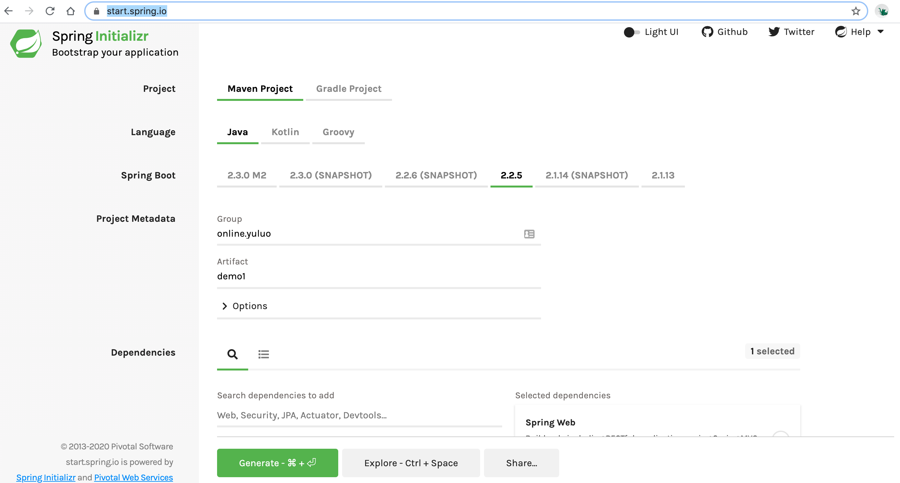

页面主要分为以下几个选项：项目类型、编程语言、Spring Boot版本号、项目描述信息、项目依赖；这里我们在依赖项先添加Spring Web依赖。

熟悉Maven项目的同学应该对这些配置不陌生，是的，搭建一个SpringBoot项目与搭建一个maven项目几乎没有什么差别。

这里可以按照图中配置，然后点击`Generate`按钮生成并下载项目。

### 1.2.导入项目

解压下载的项目压缩包，使用[IDEA](https://www.jetbrains.com/idea/ "学Java的地球人应该都知道的IDE 这里我使用的是社区版") 以maven项目形式导入，[加载依赖后](https://help.aliyun.com/document_detail/102512.html?spm=a2c40.aliyun_maven_repo.0.0.36183054hPjgJT "由于maven远程服务器在国外，项目加载依赖时，可能会非常卡顿或加载失败，可以尝试添加阿里的代理，但是请注意阿里的仓库可能会不存在最新的依赖版本，请酌情更换Spring Boot依赖版本号")，项目结构如下：

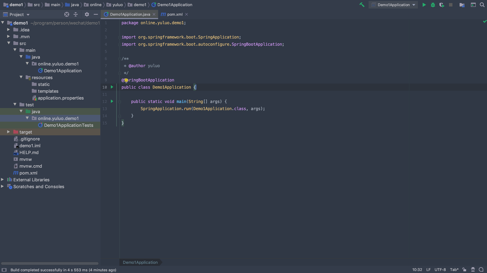

其中，`Demo1Application`为项目启动类。

### 1.3.启动项目


#### 方式一：IDE启动

由于Spring Boot内置了Tomcat服务器，我们可以直接点击启动类类名左边的三角符号或右击该类以运行项目。项目启动后如下图：

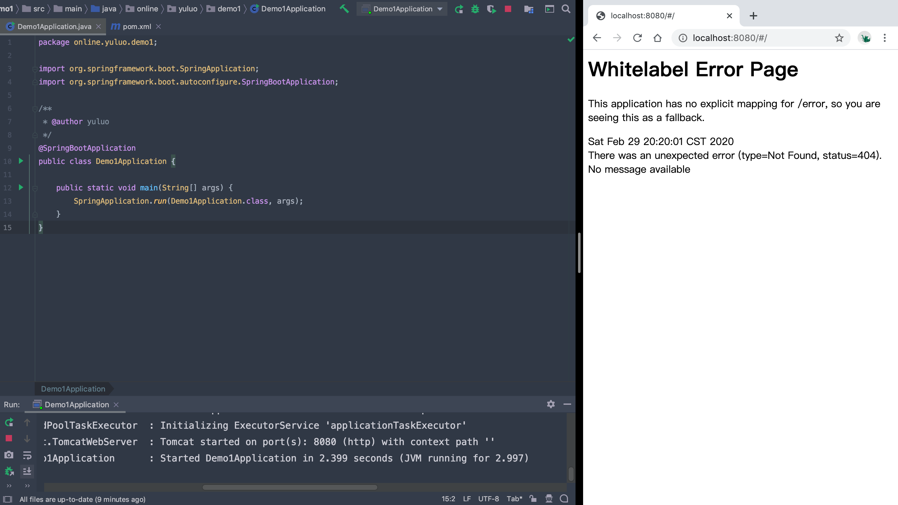

IDEA下方日志会出现服务器加载的端口号（此处为8080），在浏览器中访问对应端口号可以访问项目。因为我们还没有配置访问地址，所以此处显示的是错误信息。

*刚开始只知道IDE启动即可，后续启动方式可当阅读拓展*

#### 方式二：终端启动

打开终端，在pom.xml同级目录中，输入`mvn spring-boot:run`即可运行，运行结果如下：

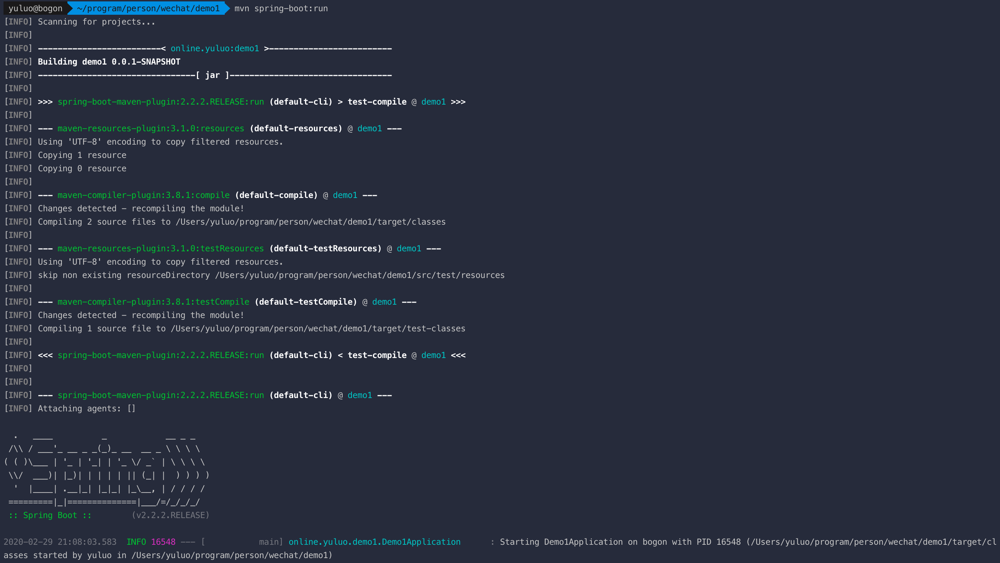

#### 方式三 jar包启动

1. 打包项目，终端指令为：`mvn install`，生成target文件夹及项目对应的jar包

2. 运行jar包，为了保证后台运行，可使用`hohup`指令：`nohup java -jar demo1-0.0.1-SNAPSHOT.jar &`

3. 停止项目，可根据提供的PID号来杀死进程

   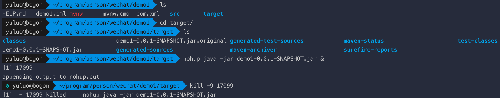

4. 在服务器中我们可以使用脚本来快捷启动或停止项目，脚本如下：

   ```shell
   #!/bin/bash
   #启动脚本 start.sh
   nohup java -jar $1 &
   ```

   启动方式：`sh start.sh demo1-0.0.1-SNAPSHOT.jar`

   ```shell
   #!/bin/bash
   #停止脚本 stop.sh
   PID=$(ps -ef | grep $1 | grep -v grep | awk '{ print $2 }')
   if [ -z "$PID" ]
   then
       echo The target application has been existed!
   else
       echo kill target $PID
       kill $PID
   fi
   ```

   停止方式：`sh stop.sh demo1-0.0.1-SNAPSHOT.jar`

   这里简单解释一下停止脚本：

   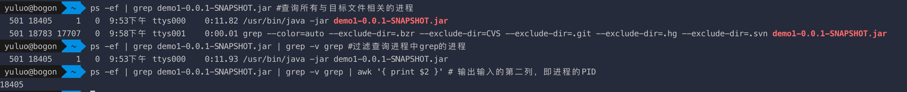

   ```shell
   > ps -ef | grep demo1-0.0.1-SNAPSHOT.jar #查询所有与目标文件相关的进程,包括grep自身
     501 18405     1   0  9:53下午 ttys000    0:11.82 /usr/bin/java -jar demo1-0.0.1-SNAPSHOT.jar
     501 18783 17707   0  9:58下午 ttys001    0:00.01 grep --color=auto --exclude-dir=.bzr --exclude-dir=CVS --exclude-dir=.git --exclude-dir=.hg --exclude-dir=.svn demo1-0.0.1-SNAPSHOT.jar
   > ps -ef | grep demo1-0.0.1-SNAPSHOT.jar | grep -v grep #过滤查询进程中grep的进程
     501 18405     1   0  9:53下午 ttys000    0:11.93 /usr/bin/java -jar demo1-0.0.1-SNAPSHOT.jar
   > ps -ef | grep demo1-0.0.1-SNAPSHOT.jar | grep -v grep | awk '{ print $2 }' # 提取输入的第二列，即进程的PID
   18405
   ```

   

### 1.4.添加简单访问路径

在启动类同级目录下创建三个名为`controller`、`service`、`dao`的文件夹用于`视图`、`服务`、`数据控制`。在controller文件夹创建一个IndexController.java的文件，代码及结构如下图：

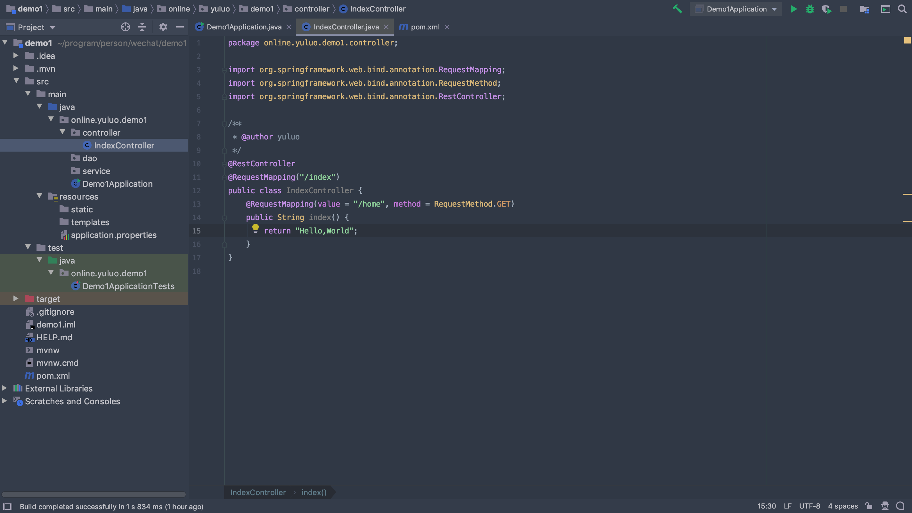

重新启动服务，浏览器访问http://localhost:8080/index/home 即可看到效果。

## 方式二：[IDEA](https://www.jetbrains.com/idea/ "此处指的是IDEA Ultimate收费版本")本地创建项目

### 2.1.选择Spring Initializr

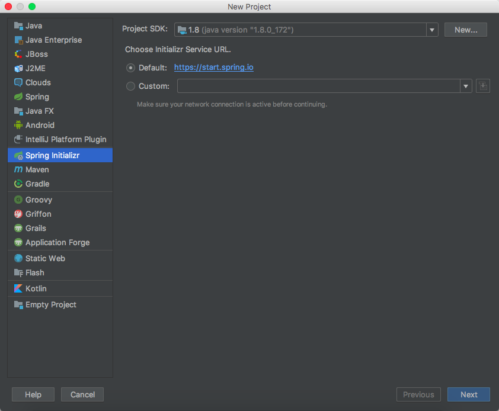

### 2.2.配置项目信息
主要填写`Group`与`Artifact`字段，其他字段按需修改
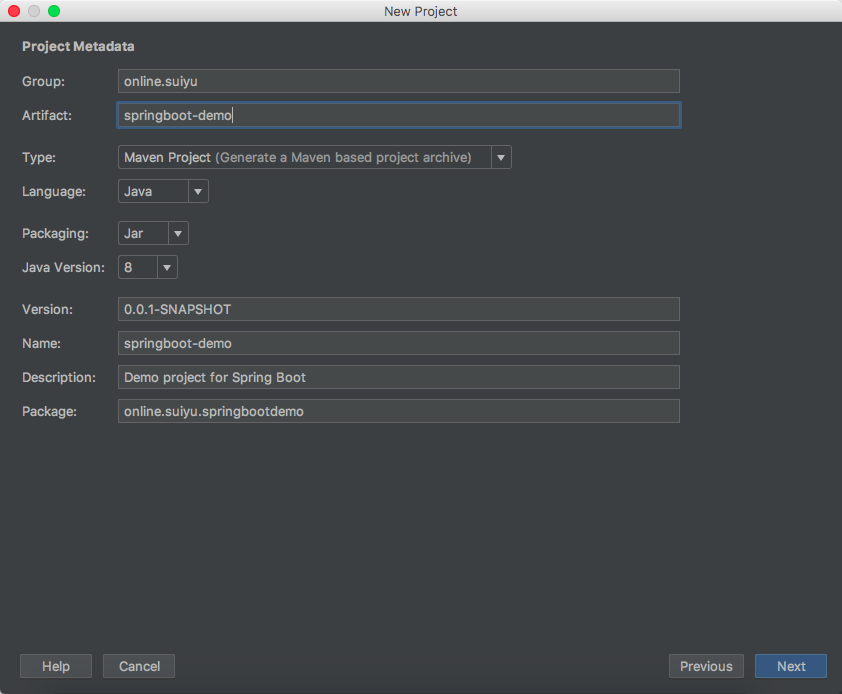

### 2.3.添加所需依赖
  在此先添加JDBC依赖，会在后文详细记录。
  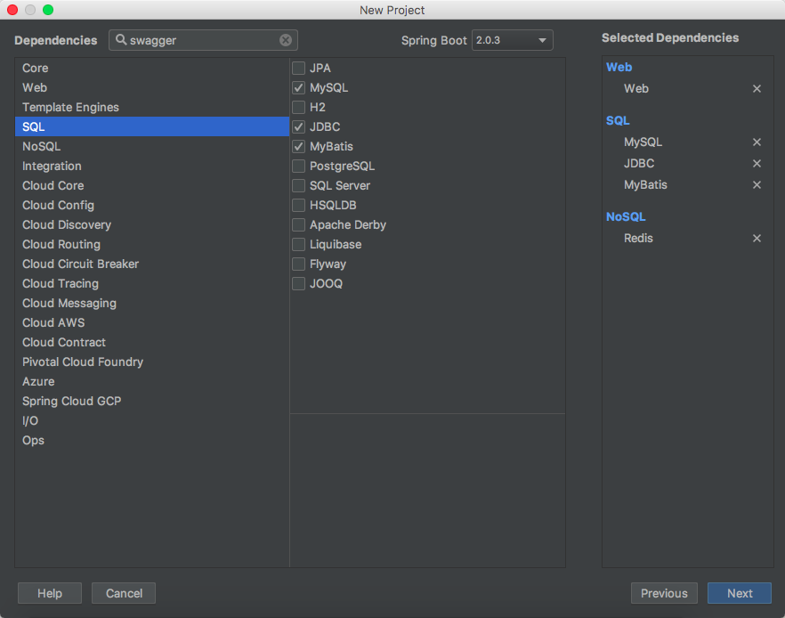

### 2.4.选择地址保存项目

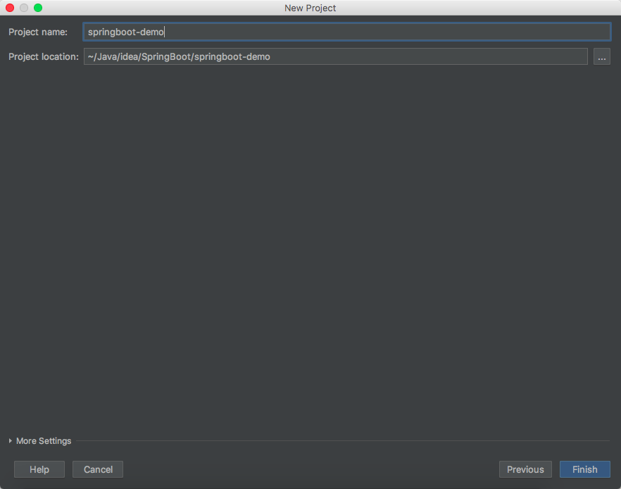

到此，点击finish，即可完成简单的SpringBoot项目搭建。
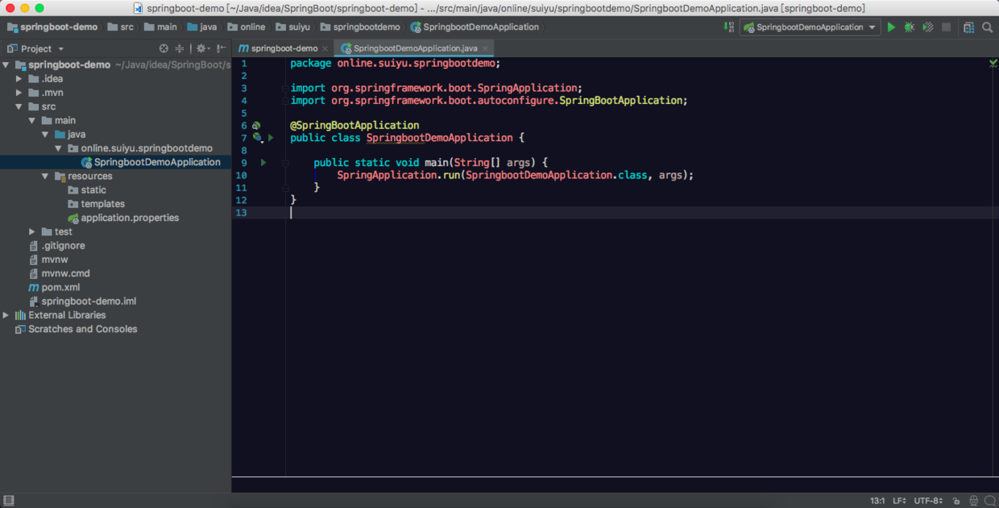

但此时如果想要直接运行项目，需要将前面额外添加的数据库驱动依赖注释掉，否则会引起异常，因为我们还没有配置数据库连接信息！
```xml
<?xml version="1.0" encoding="UTF-8"?>
<project xmlns="http://maven.apache.org/POM/4.0.0" xmlns:xsi="http://www.w3.org/2001/XMLSchema-instance"
         xsi:schemaLocation="http://maven.apache.org/POM/4.0.0 http://maven.apache.org/xsd/maven-4.0.0.xsd">
    <modelVersion>4.0.0</modelVersion>
    <groupId>online.suiyu</groupId>
    <artifactId>springboot-demo</artifactId>
    <version>0.0.1-SNAPSHOT</version>
    <packaging>jar</packaging>
    <name>springboot-demo</name>
    <description>Demo project for Spring Boot</description>
    <parent>
        <groupId>org.springframework.boot</groupId>
        <artifactId>spring-boot-starter-parent</artifactId>
        <version>2.0.3.RELEASE</version>
        <relativePath/> <!-- lookup parent from repository -->
    </parent>
    <properties>
        <project.build.sourceEncoding>UTF-8</project.build.sourceEncoding>
        <project.reporting.outputEncoding>UTF-8</project.reporting.outputEncoding>
        <java.version>1.8</java.version>
    </properties>
    <dependencies>
        <!--<dependency>-->
            <!--<groupId>org.springframework.boot</groupId>-->
            <!--<artifactId>spring-boot-starter-data-redis</artifactId>-->
        <!--</dependency>-->
        <!--<dependency>-->
            <!--<groupId>org.springframework.boot</groupId>-->
            <!--<artifactId>spring-boot-starter-jdbc</artifactId>-->
        <!--</dependency>-->
        <!--<dependency>-->
            <!--<groupId>mysql</groupId>-->
            <!--<artifactId>mysql-connector-java</artifactId>-->
            <!--<scope>runtime</scope>-->
        <!--</dependency>-->
        <!--<dependency>-->
            <!--<groupId>org.mybatis.spring.boot</groupId>-->
            <!--<artifactId>mybatis-spring-boot-starter</artifactId>-->
            <!--<version>1.3.2</version>-->
        <!--</dependency>-->
        <dependency>
            <groupId>org.springframework.boot</groupId>
            <artifactId>spring-boot-starter-web</artifactId>
        </dependency>
        <dependency>
            <groupId>org.springframework.boot</groupId>
            <artifactId>spring-boot-starter-test</artifactId>
            <scope>test</scope>
        </dependency>
    </dependencies>
    <build>
        <plugins>
            <plugin>
                <groupId>org.springframework.boot</groupId>
                <artifactId>spring-boot-maven-plugin</artifactId>
            </plugin>
        </plugins>
    </build>
</project>
```

关于SpringBoot项目的创建还有很多其他方式，比如[STS](https://spring.io/tools/ "Spring官方提供的eclipse插件或基于eclipse的IDE")或者maven手动添加依赖及项目文件都可以，这里不多赘述。

## 项目结构及注解简析

### 3.1项目结构

SpringBoot项目简单结构如下：

```shell
├── demo1
│   ├── pom.xml # 依赖管理
│   ├── src
│   │   ├── main
│   │   │   ├── java # 核心代码
│   │   │   │   └── online
│   │   │   │       └── yuluo
│   │   │   │           └── demo1
│   │   │   │               ├── Demo1Application.java
│   │   │   │               ├── controller
│   │   │   │               ├── dao
│   │   │   │               └── service
│   │   │   └── resources #项目资源文件
│   │   │       ├── application.properties #项目配置文件 可用application.yml代替
│   │   │       ├── static #静态资源文件
│   │   │       └── templates #模板文件，可存放邮件、SMS等模板
│   │   └── test #测试
│   │       └── java
│   │           └── online
│   │               └── yuluo
│   │                   └── demo1
│   │                       └── Demo1ApplicationTests.java
│   └── target #打包目标生成文件
```

### 3.2本文涉及注解

1. `@SpringBootApplication`：SpringBoot入口文件专用，等价于以下三个注解：
   1. `@SpringBootConfiguration`：应用了Spring中的`@Configuration`注解，与`@Bean`搭配可取代XML文件，将对象注册为Bean
   2. `@EnableAutoConfiguration`：自动配置Spring上下文，将所有符合条件的`@Configuration`配置加载到IOC容器中
   3. `@ComponentScan`:自动扫描所有`@Component`注解，将其注册为Bean
2. `@RestController`：等价于以下两个注解：
   1. `@Controller`：`@Component`的子注解
   2. `@ResponseBody`：将返回的Java对象信息转换为Json数据返回
3. `@RequestMapping`：将HTTP请求映射到REST控制器上，可以配置请求路径及请求方式，后面会见到很多用法