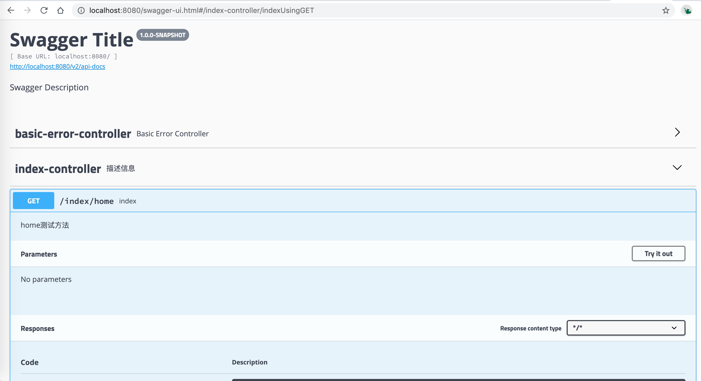

# SpringBoot学习笔记二：整合Swagger UI

[TOC]

Swagger UI是一个为项目提供可视API文档的规范定义开源项目，它可以帮我们快速预览项目接口，并提供模拟请求的功能。下面以上一篇搭建好的SpringBoot项目为例，介绍一下如何使用Swagger UI。

## 1.添加Swagger UI依赖

```xml
<dependency>
  <groupId>io.springfox</groupId>
  <artifactId>springfox-swagger2</artifactId>
  <version>2.9.2</version>
</dependency>
<dependency>
  <groupId>io.springfox</groupId>
  <artifactId>springfox-swagger-ui</artifactId>
  <version>2.9.2</version>
</dependency>
```

## 2.创建配置文件SwaggerConfig

首先，在启动文件（此处为Demo1Application）同级目录下创建一个`config`文件夹用以配置项目相关信息。在该文件夹下创建一个`SwaggerConfig.java`文件用以配置Swagger UI的相关信息，同时将Swagger注册为Bean，以使其注解有效。其代码如下：

```java
// SwaggerConfig.java
@Configuration
@EnableSwagger2
public class SwaggerConfig {
    @Bean
    public Docket createRestApi() {
        return new Docket(DocumentationType.SWAGGER_2)
                .apiInfo(apiInfo()).select().apis(RequestHandlerSelectors.any())
                .paths(PathSelectors.any()).build();
    }

    private ApiInfo apiInfo() {
        return new ApiInfoBuilder()
                .title("Swagger Title") // 配置项目的Swagger UI标题
                .description("Swagger Description") // 配置描述信息
                .version("1.0.0-SNAPSHOT") // 项目版本信息
                .build();
    }
}
```

## 3.给Controller添加注解

以`IndexController`为例，给代码添加注解如下：

```java
@Api(value = "index测试类", description = "描述信息")
@RestController
@RequestMapping("/index")
public class IndexController {
    @ApiOperation(value = "index", notes = "home测试方法") // tags
    @RequestMapping(value = "/home", method = RequestMethod.GET)
    public String index() {
        return "Hello,World";
    }
}
```

访问默认路径http://localhost:8080/swagger-ui.html，其效果如下：



到此，日常使用不成问题，详细使用可查看官方文档：https://swagger.io/docs/