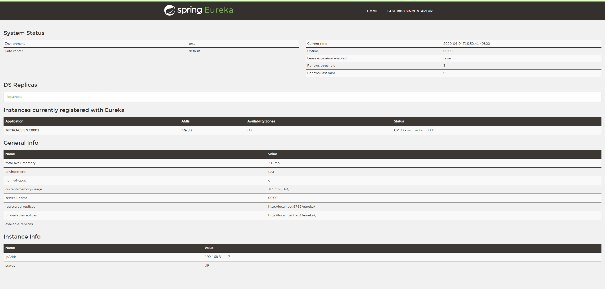
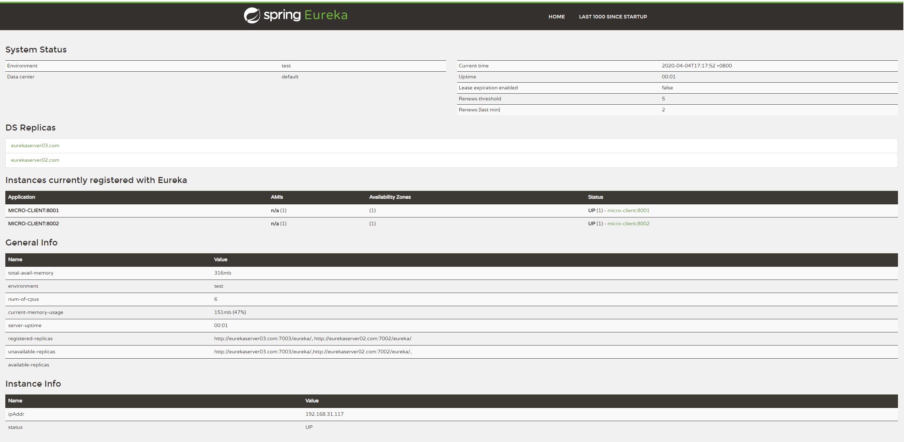

[TOC]

## Eureka Server

Eureka Server主要作为服务注册中心使用。

搭建过程：

### 添加Eureka Server依赖

```xml
<!--父依赖-->
<parent>
  <groupId>org.springframework.boot</groupId>
  <artifactId>spring-boot-starter-parent</artifactId>
  <version>2.2.6.RELEASE</version>
  <relativePath/> <!-- lookup parent from repository -->
</parent>

<!--Eureka Server-->
<dependency>
  <groupId>org.springframework.cloud</groupId>
  <artifactId>spring-cloud-starter-netflix-eureka-server</artifactId>
</dependency>
```

### 配置文件修改

```yaml
server:
  port: 7001 # 端口号
eureka:
  instance:
    hostname: eurekaserver01.com # 服务地址,将eurekaserver01.com添加到host，后面有介绍
  client:
    register-with-eureka: false #是否向注册中心注册
    fetch-registry: false # 是否去用户中心获取其他已注册服务信息
```

### 启动类添加注解

```java
@EnableEurekaServer // 将本服务配置为注册中心
@SpringBootApplication
public class EurekaServerApplication {
	public static void main(String[] args) {
		SpringApplication.run(EurekaServerApplication.class, args);
	}
}
```


启动服务后，访问http://localhost:7001/即可访问Eureka监控页面



## Eureka Client


### 引入依赖

```xml
<!--父依赖-->
<parent>
  <groupId>org.springframework.boot</groupId>
  <artifactId>spring-boot-starter-parent</artifactId>
  <version>2.2.6.RELEASE</version>
  <relativePath/> <!-- lookup parent from repository -->
</parent>
<!--Eureka Client-->
<dependency>
  <groupId>org.springframework.cloud</groupId>
  <artifactId>spring-cloud-starter-netflix-eureka-client</artifactId>
</dependency>
```

### 配置文件修改

```yaml
server:
  port: 8081
spring:
   application:
      name: micro-client
eureka:
  client:
    service-url:
      defaultZone: http://eurekaserver01.com:7001/eureka  # 注册中心地址
  instance:
    instance-id: micro-client:8081 # 本服务实例信息
    prefer-ip-address: true #暴露IP地址
```

### 启动类添加注解

```java
@EnableEurekaClient
@SpringBootApplication
public class EurekaClientApplication {
	public static void main(String[] args) {
		SpringApplication.run(EurekaClientApplication.class, args);
	}
}
```

注解`@EnableEurekaClient`与`@EnableDiscoveryClient`用法及功能类似，主要是暴露服务被注册中心发现，前者主要针对Eureka使用。Spring Cloud Edgware版本之后该注解省略也可注册服务到注册中心（只需要引入client依赖就行了）。

## 服务发现与远程调用

通过SpringCloud提供的DiscoveryClient可以发现其他服务的元数据。

### 服务发现

复制一个Eureka Client项目，将其修改为eureka-consumer，用来执行调用其他服务的操作（消费者）。

在消费者的Controller中尝试获取其他服务的信息：

```java
// eureka-consumer
import org.springframework.cloud.client.discovery.DiscoveryClient;
@RestController
@RequestMapping(value = "/api/consumer")
public class IndexController {
	@Autowired
	private DiscoveryClient discoveryClient;
	@GetMapping(value = "/getInstances/{serviceId}")
	public String getInstancesInfo(@PathVariable String serviceId) {
		List<ServiceInstance> instanceList = discoveryClient.getInstances(serviceId);
		return JSON.toJSONString(instanceList);
	}
}
```

启动后访问localhost:8003/api/consumer/getInstances/MICRO-CLIENT 即可查看其他服务的信息。应当注意这个输入的serviceId为服务生产者的application.name值

### 服务间的远程调用

当服务向同一个注册中心注册后可以相互发现并远程调用。本次使用`RestTemplate`

在启动类中添加RestTemplate的Bean初始化

```java
// eureka-consumer
@EnableEurekaClient
@SpringBootApplication
public class EurekaClientApplication2 {
	@Bean(value = "restTemplate")
	public RestTemplate restTemplate() {
		return new RestTemplate();
	}
	public static void main(String[] args) {
		SpringApplication.run(EurekaClientApplication2.class, args);
	}
}
```

在原项目eureka-client中创建Controller模拟一个接口用以被调用（生产者）。

```java
// eureka-client
@RestController
@RequestMapping(value = "/api/index")
public class IndexController {
	@Value("${eureka.instance.instance-id}")
	private String ipAdress;
	@Value("${server.port}")
	private String port;
	@GetMapping(value = "/getMsg")
	public String getMsg() {
		return "Hello," + ipAdress + ":" + port;
	}
}
```

在eureka-consumer项目中也创建一个Controller用以触发远程调用（消费者）。

```java
// eureka-consumer
@RestController
@RequestMapping(value = "/api/consumer")
public class IndexController {
	@Autowired
	private RestTemplate restTemplate;
    // 方式1
	@GetMapping(value = "/getMsg")
	public String getMsg() {
		return restTemplate.getForObject("http://localhost:8001/api/index/getMsg", String.class);
	}
    // 方式2
    @GetMapping(value = "/getMsg/{serviceId}")
    public String getInstanceMsg(@PathVariable String serviceId) {
        List<ServiceInstance> instanceList = discoveryClient.getInstances(serviceId);
        if (instanceList.isEmpty()) {
            logger.info("");
            // throw
        }
        ServiceInstance serviceInstance = instanceList.get(0);
        return restTemplate.getForObject(
            "http://" + serviceInstance.getHost() + ":" + serviceInstance.getPort() + "/api/index/getMsg",
            String.class);
	}
}
```

如上代码，使用getForObject接收一个远程服务的接口地址即可。方式2借助了前面的服务发现，只需要提供生产者的application.name的值即可（生产者暴露的application名称）


## 构建Eureka Server集群

复制上方Eureka Server项目，组成`Eureka-server`、`Eureka-server1`、`Eureka-server2`三个服务，其配置文件如下：

```yaml
# Eureka-server
server:
  port: 7001 # 端口号
eureka:
  instance:
    hostname: eurekaserver01.com # 服务地址
  client:
    register-with-eureka: false #是否向注册中心注册
    fetch-registry: false # 是否去用户中心获取其他已注册服务信息
    service-url:
      defaultZone: http://eurekaserver02.com:7002/eureka/,http://eurekaserver03.com:7003/eureka/
```

```yaml
# Eureka-server1
server:
  port: 7002 # 端口号
eureka:
  instance:
    hostname: eurekaserver02.com # 服务地址
  client:
    register-with-eureka: false #是否向注册中心注册
    fetch-registry: false # 是否去用户中心获取其他已注册服务信息
    service-url:
      defaultZone: http://eurekaserver01.com:7001/eureka/,http://eurekaserver03.com:7003/eureka/

```

```yaml
# Eureka-serve2
server:
  port: 7003 # 端口号
eureka:
  instance:
    hostname: eurekaserver03.com # 服务地址
  client:
    register-with-eureka: false #是否向注册中心注册
    fetch-registry: false # 是否去用户中心获取其他已注册服务信息
    service-url:
      defaultZone: http://eurekaserver02.com:7002/eureka/,http://eurekaserver01.com:7001/eureka/

```

同时将三个Eureka Server的hostname加入到系统的HOST文件中（相同域名下的不同端口号发布的多个服务不会被Client识别）：

```
127.0.0.1 eurekaserver01.com
127.0.0.1 eurekaserver02.com
127.0.0.1 eurekaserver03.com
```


复制Eureka Client项目，组成`Eureka-client`、`Eureka-client1`两个项目以备后续调用，其配置文件如下：

```yaml
server:
  port: 8001

spring:
   application:
      name: micro-client:8001 #暴露到注册中心的服务名称
eureka:
  client:
    fetch-registry: true # 是否去注册中心获取其他注册模块信息
    service-url:
      defaultZone: http://eurekaserver01.com:7001/eureka,http://eurekaserver02.com:7002/eureka,http://eurekaserver03.com:7003/eureka  # 注册中心地址
  instance:
    instance-id: micro-client:8001 # 本服务实例信息
    prefer-ip-address: true # 将服务IP注册到注册中心
```

```yaml
server:
  port: 8002

spring:
   application:
      name: micro-client:8002
eureka:
  client:
    fetch-registry: true # 是否去注册中心获取其他注册模块信息
    service-url:
      defaultZone: http://eurekaserver01.com:7001/eureka,http://eurekaserver02.com:7002/eureka,http://eurekaserver03.com:7003/eureka  # 注册中心地址
  instance:
    instance-id: micro-client:8002 # 本服务实例信息
    prefer-ip-address: true
```

访问eurekaserver01.com:7001，显示如下：



## 相关原理及配置

CAP：

- 一致性（Consistency）：同一个数据在集群中的所有节点，同一时刻是否都是同样的值。
- 可用性（Availability）：集群中一部分节点故障后，集群整体是否还能处理客户端的请求。
- 分区容忍性（Partition tolerance）：是否允许集群中的节点之间无法通信。

Eureka：AP原则，Zookeeper：CP原则


1. 服务注册（Register）
注册服务列表是以嵌套HashMap格式存在的，Eurek客户端自检时，如果不可用，将会向注册中心更新状态，同时用replicateToPeers()向其他Eureka服务器节点做状态同步
eureka.client.register-with-eureka控制是否向注册中心注册

2. 服务续约（Renew）
客户端每隔一段时间向服务器发送一次心跳（即续约请求，默认为30s，eureka.instance.lease-renewal-interval-in-seconds控制心跳时间）
若服务器在一段时间内（默认为90s，可通过eureka.instance.lease-expiration-duration-in-seconds修改），没有收到客户端的续约请求，则剔除该服务。
若服务器开启了保护模式，则不会剔除。

3. 获取服务
客户端每隔30s会获取服务器注册列表并缓存到本地

4. Region&Zone
概念来自于AWS（Amazon Web Services），客户端优先访问速度最快的服务器。
Region：可以理解为地理上的分区，比如华南区、华北区、北京、深圳等
zone：可以理解为机房，比如深圳的两个机房

### Eureka自我保护

Eureka服务器每分钟接收心跳续约的次数少于一个阈值就会触发自我保护，防止已注册的服务被剔除(AP原则)。

