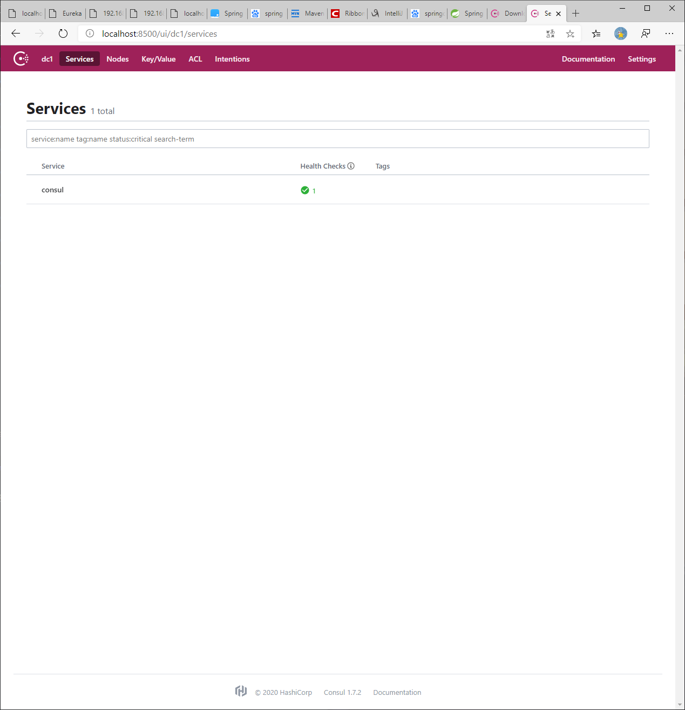

[TOC]

## 安装Consul

官网[下载Consul](https://www.consul.io/downloads.html)安装包文件，添加目录到系统环境变量，输入以下指令即可运行consul：

```shell
consul agent -dev -client=0.0.0.0
```

访问localhost:8500即可查看服务管理页面



## 搭建Spring Cloud consul项目

### 添加依赖

```xml
<dependency>
    <groupId>org.springframework.cloud</groupId>
    <artifactId>spring-cloud-starter-consul-config</artifactId>
</dependency>
<dependency>
    <groupId>org.springframework.cloud</groupId>
    <artifactId>spring-cloud-starter-consul-discovery</artifactId>
</dependency>
```

### 添加配置

```yaml
server:
  port: 9001
spring:
  application:
    name: consul-producer
  cloud:
    consul: # consul服务配置
      host: localhost
      port: 8500 # consul服务端口号
      discovery:
        register: true #是否需要注册
        instance-id: ${spring.application.name} # 注册实例ID
        service-name: ${spring.application.name} # 服务名称
        port: ${server.port} # 服务请求端口号
        prefer-ip-adress: true # 指定开启IP地址注册
        ip-adress: ${spring.cloud.client.ip-adress} # 当前服务的ip地址
```

其他配置及代码与Eureka一致，启动项目后，查看consul管理页面，即可查看注册的consul-producer服务。

## 服务发现及调用

consul服务发现与eureka调用discoveryClient一致；服务调用也与Eureka调用restTemplate远程调用一致。另外，consul也集成了ribbon，因此，负载均衡也一致。

[源码访问](https://github.com/xiaozheng243/SpringCloud/tree/a89ae848)