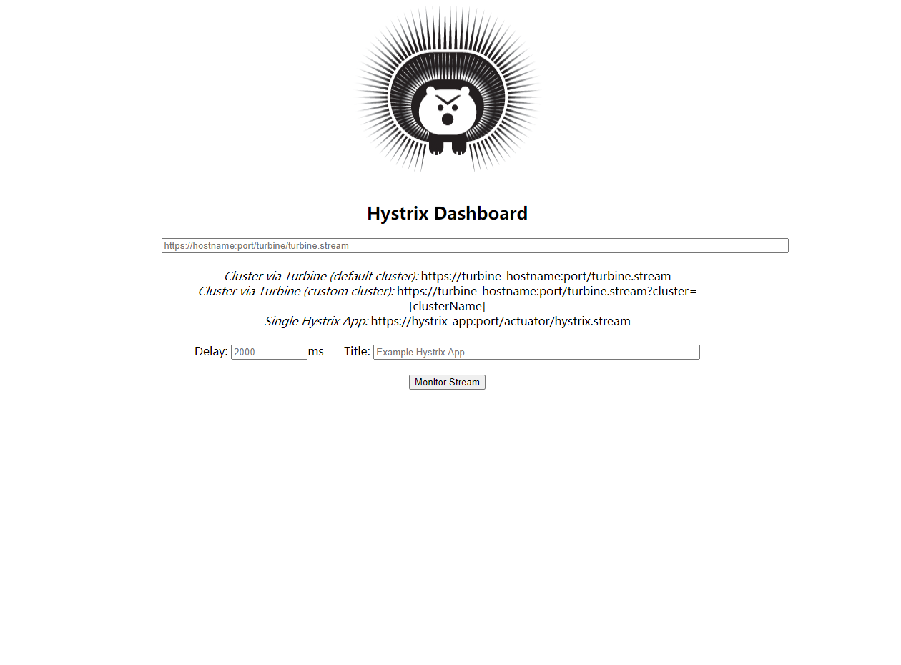

[TOC]

Hystrix实现了对restTemplate与Feigin的支持。

Hystrix功能：

1. 调用熔断

对于Hystrix的支持，只需要针对消费者(调用方)修改即可。

## 添加依赖

在消费者中添加Hystrix的依赖：
```xml
<dependency>
    <groupId>org.springframework.cloud</groupId>
    <artifactId>spring-cloud-starter-netflix-hystrix</artifactId>
</dependency>
```


## 添加注解

在启动类添加`@EnableCircuitBreaker`，然后配置RestTemplate以备远程调用。

```java
@EnableEurekaClient
@SpringBootApplication
@EnableCircuitBreaker
public class EurekaConsumerApplication1 {

    @LoadBalanced
    @Bean(value = "restTemplate")
    public RestTemplate restTemplate() {
        return new RestTemplate();
    }

    public static void main(String[] args) {
        SpringApplication.run(EurekaConsumerApplication1.class, args);
    }
}
```

## 添加程端调用

```java
@RestController
@RequestMapping(value = "/api/consumer")
public class IndexController {

    @Autowired
    private RestTemplate restTemplate;

    @HystrixCommand(fallbackMethod = "getMsgFallBack")
    @GetMapping(value = "/getRemoteMsg")
    public String remoteIndexController() {
        return restTemplate.getForObject("http://MICRO-PRODUCER/api/index/getMsg", String.class);
    }

    public String getMsgFallBack() {
        return "本消息来自于服务降级处理方法！";
    }

}
```

其中，` @HystrixCommand`用以指定熔断时的服务降级处理方法。服务降级处理方法的参数列表及返回值类型应与原方法一致。

生产者（服务提供者）代码省略，最简单的测试方法是关闭服务提供者，查看消费者的远程调用是否返回服务降级处理方法的内容。

[查看源码，涉及服务为eureka-consumer1->eureka-server0->eureka-producer0](https://gitee.com/xiaozheng243/SpringCloud/tree/hystrix/spring-cloud-parent)


## 添加类中的统一服务降级处理方法

为应对多个方法需要触发熔断机制，可以提供统一服务降级处理方法。其代码如下：

```java
@RestController
@RequestMapping(value = "/api/consumer")
@DefaultProperties(defaultFallback = "defaultFallBack")
public class IndexController {

    @Autowired
    private RestTemplate restTemplate;

    @HystrixCommand //(fallbackMethod = "getMsgFallBack")
    @GetMapping(value = "/getRemoteMsg")
    public String remoteIndexController() {
        return restTemplate.getForObject("http://MICRO-PRODUCER/api/index/getMsg", String.class);
    }
    
    public String getMsgFallBack() {
        return "本消息来自于服务降级处理方法！";
    }
    
    public String defaultFallBack(){
        return "本消息来自于统一服务降级处理方法";
    }
}
```

修改内容：

1. 添加统一的服务降级处理方法，该方法返回值应该与所有原方法一致，并保证参数列表为空
2. 移除方法指定的服务降级处理方法
3. 给类添加统一的服务降级处理方法

# Feign集成Hystrix

关于Feign的简单使用，可查看[SpringCloud学习笔记四：Feign]

## 引入依赖

Feign已经集成了Hystrix，如果已引入Feigin，可省略

```xml
<!-- https://mvnrepository.com/artifact/org.springframework.cloud/spring-cloud-starter-feign -->
<dependency>
    <groupId>org.springframework.cloud</groupId>
    <artifactId>spring-cloud-starter-feign</artifactId>
    <version>1.4.7.RELEASE</version>
</dependency>
```


## 开启Hystrix

在配置文件中添加如下配置：

```yaml
feign:
  hystrix:
    enabled: true # Feign添加对Hystrix的支持
```

## 添加服务降级处理方法

创建类，实现Feign远程调用的接口，此类即为服务降级处理方法。

```java
public class ClientIndexServiceImpl implements ClientIndexService {

    /**
     * 服务降级处理方法
     *
     * @return 服务降级处理方法内容
     */
    @Override
    public String getMsg() {
        return "本消息由Feign触发的服务降级处理方法！";
    }
}

```

## 修改@FeignClient注解

```java
@FeignClient(name = "micro-producer", fallback = ClientIndexServiceImpl.class)
public interface ClientIndexService {
    @GetMapping(value = "/api/index/getMsg")
    public String getMsg();
}
```

name指定生产者服务名称，fallback指定熔断时触发的服务降级处理方法。

[查看源码,涉及服务为eureka-consumer0->eureka-server0->eureka-producer0](https://gitee.com/xiaozheng243/SpringCloud/tree/ff24682b)


# 添加 Actuator对Hystrix的监控

## 添加依赖

在上方项目中消费者添加以下依赖

```xml
<dependency>
    <groupId>org.springframework.cloud</groupId>
    <artifactId>spring-cloud-starter-netflix-hystrix</artifactId>
</dependency>
<dependency>
    <groupId>org.springframework.boot</groupId>
    <artifactId>spring-boot-starter-actuator</artifactId>
</dependency>
<dependency>
    <groupId>org.springframework.cloud</groupId>
    <artifactId>spring-cloud-starter-netflix-hystrix-dashboard</artifactId>
</dependency>
```

## 添加启动注解

```java
@EnableCircuitBreaker
@EnableEurekaClient
@EnableFeignClients
@SpringBootApplication
public class EurekaConsumerApplication0 {

    @LoadBalanced
    @Bean(value = "restTemplate")
    public RestTemplate restTemplate() {
        return new RestTemplate();
    }

    public static void main(String[] args) {
        SpringApplication.run(EurekaConsumerApplication0.class, args);
    }
}
```

在启动类上方添加Hystrix启动注解

## 添加端点监控配置

```yaml
management:
  endpoints:
    web:
      exposure:
        include: '*' #暴露所有端点
```

到此完成，打开[http://localhost:9000/actuator/hystrix.stream](http://localhost:9000/actuator/hystrix.stream)即可查看监控信息（需要触发接口访问）。

# 添加Hystrix DashBoard的监控

依赖及配置已在上方相同添加，只需要添加启动Hystrix DashBoard的注解即可。

```java
@EnableHystrixDashboard // 启动hystrix dashboard
@EnableCircuitBreaker
@EnableEurekaClient
@EnableFeignClients
@SpringBootApplication
public class EurekaConsumerApplication0 {

    @LoadBalanced
    @Bean(value = "restTemplate")
    public RestTemplate restTemplate() {
        return new RestTemplate();
    }

    public static void main(String[] args) {
        SpringApplication.run(EurekaConsumerApplication0.class, args);
    }

}
```

启动项目，访问[http://localhost:9000/hystrix](http://localhost:9000/hystrix)，即可查看以下页面：



在第一个输入框中输入http://localhost:9000/actuator/hystrix.stream 即可查看监控信息：

